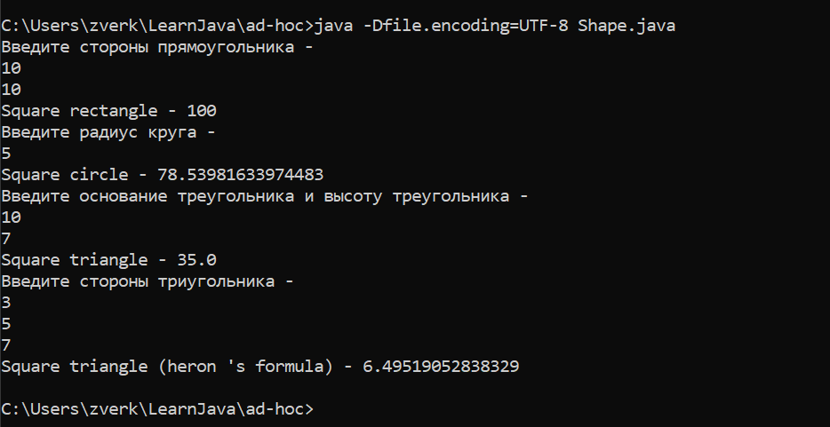

# Java в командной строке
Для решения задачи я взял пример с прошлого задания по ad-hoc полиморфизм. В этом задании я сделал методы для расчета площадей разных фигур. В доплнении я добавил ввод переменных с командной строки. 

----
### Компиляция нашей программы
```shell
javac -encoding UTF-8 Shape.java
```
------
### Запуск нашей программы
```shell
java -Dfile.encoding=UTF-8 Shape.java
``` 
-----

### Вывод 
